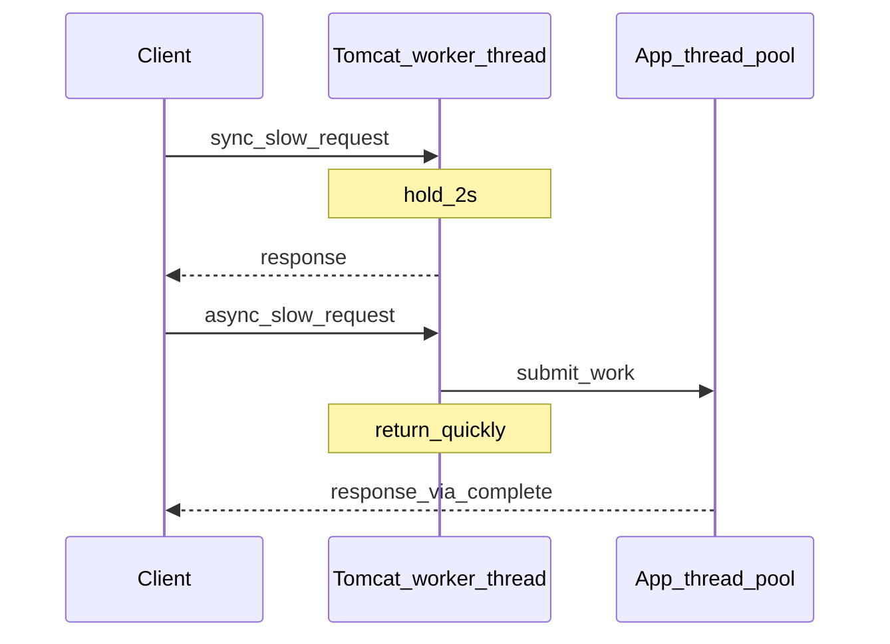

# 第3章 案例一：阻塞式 Servlet vs 非阻塞式 Servlet 圣战 PK（正文初稿）

> 对应总纲：**Tomcat 实战应用** 第一个案例。本章「非阻塞」在 **Servlet 应用层** 主要指 **Servlet 3.0+ 异步**：通过 `AsyncContext` **释放容器工作线程**，把耗时工作交给应用线程池；不要与 **NIO 连接器** 混为一谈（二者相关但层次不同）。

---

## 本章导读

- **你要带走的三件事**
  1. **阻塞点**：同步 Servlet 在 **`service` 返回前** 一直占用 Tomcat 线程池中的一个线程。
  2. **异步收益**：`startAsync()` 后容器线程可归还；**吞吐与线程数**关系被重塑，但 **CPU 与业务耗时**不会凭空消失。
  3. **代价**：线程安全、超时、错误处理、监控、以及 **Filter 也必须 `asyncSupported=true`**。

- **阅读建议**：先写两个最小 Servlet 压测，再带着数据读 `StandardWrapperValve` 与 `AsyncContextImpl`。

---

## 3.1 案例目标

1. **对比**「同步慢请求」与「异步慢请求」在 **相同并发** 下的 **TPS、P95/P99、活跃线程数**。
2. 建立统一 **实验报告模板**，以后调 Connector / JVM 可复用。
3. 能口述：**什么时候该用异步 Servlet，什么时候不该用**。

---

## 3.2 核心问题

### 3.2.1 阻塞点在哪里？

- 同步模型下：**从 `FilterChain.doFilter` 进入 `Servlet.service`，直到 `service` 返回（及响应提交）**，Tomcat 工作线程一直被占用。
- 若慢在 **RPC、DB、睡眠**，线程大量 **BLOCKED/WAITING**，新请求只能排队或触发 **`acceptCount` 队列** 满后拒绝。

### 3.2.2 异步究竟释放了什么？

- 释放的是 **处理该请求的容器工作线程**（`Executor` 线程池里的线程），使其可服务其他连接。
- **不释放**：业务仍需占用 **某处线程**（你自己提交的线程池）或 **某段 CPU**；若只是把活挪到无界线程池，可能 **把系统拖死**。

### 3.2.3 收益与代价

| 方面 | 潜在收益 | 代价/风险 |
|------|----------|-----------|
| 吞吐 | 同样 `maxThreads` 可扛更多「等 IO」请求 | 业务线程池需限流、队列、拒绝策略 |
| 延迟 | 排队减少时 P95 可能下降 | 调度开销、错误栈变复杂 |
| 可观测性 | 容器线程「看起来不忙」 | 需单独监控业务线程池与异步超时 |
| 开发 | 高并发下更可控 | Filter/Listener 全链路异步配置、异常边界 |

---

## 3.3 源码锚点

| 类/接口 | 读什么 |
|---------|--------|
| `javax.servlet.AsyncContext` | 规范 API：`start`、`complete`、`dispatch`、`setTimeout` |
| `org.apache.catalina.core.AsyncContextImpl` | Tomcat 实现：与 `Request`/`Response`、生命周期交互 |
| `org.apache.catalina.core.StandardWrapperValve` | 普通请求与异步请求的 **分支**；何时结束容器责任 |
| `javax.servlet.ServletRequest#startAsync` | 入口：谁可以调用、何时非法 |

**读法提示**：在 `StandardWrapperValve` 内搜索 **`async`**、`AsyncContext`，对照 Servlet 规范看 **「容器何时认为请求处理结束」**。

---

## 3.4 最小可运行示例（实验用）

### 3.4.1 同步慢 Servlet（阻塞容器线程）

```java
@WebServlet(urlPatterns = "/sync-slow")
public class SyncSlowServlet extends HttpServlet {

    @Override
    protected void doGet(HttpServletRequest req, HttpServletResponse resp)
            throws IOException {
        resp.setContentType("text/plain;charset=UTF-8");
        try {
            Thread.sleep(2000); // 模拟下游 IO：请勿在生产 Thread.sleep
        } catch (InterruptedException e) {
            Thread.currentThread().interrupt();
            resp.setStatus(500);
            return;
        }
        resp.getWriter().println("sync ok");
    }
}
```

### 3.4.2 异步慢 Servlet（释放容器线程）

```java
@WebServlet(urlPatterns = "/async-slow", asyncSupported = true)
public class AsyncSlowServlet extends HttpServlet {

    private final ExecutorService exec = Executors.newFixedThreadPool(50);

    @Override
    protected void doGet(HttpServletRequest req, HttpServletResponse resp) {
        resp.setContentType("text/plain;charset=UTF-8");
        AsyncContext ac = req.startAsync();
        ac.setTimeout(30_000);
        ac.addListener(new AsyncListener() {
            @Override
            public void onComplete(AsyncEvent event) { /* 可打日志 */ }
            @Override
            public void onTimeout(AsyncEvent event) throws IOException {
                event.getAsyncContext().getResponse().getWriter().println("timeout");
                event.getAsyncContext().complete();
            }
            @Override
            public void onError(AsyncEvent event) { /* 记录异常 */ }
            @Override
            public void onStartAsync(AsyncEvent event) { }
        });
        exec.execute(() -> {
            try {
                Thread.sleep(2000);
                HttpServletResponse r = (HttpServletResponse) ac.getResponse();
                r.getWriter().println("async ok");
            } catch (Exception e) {
                // 生产应记录 traceId
            } finally {
                ac.complete();
            }
        });
    }

    @Override
    public void destroy() {
        exec.shutdown();
    }
}
```

**注意**：

- 参与链路的 **Filter** 必须 **`asyncSupported = true`**，否则异步启动会失败或行为异常。
- 示例线程池仅为教学；生产需 **有界队列 + 拒绝策略 + 监控**。

---

## 3.5 压测与评估维度

### 3.5.1 指标

| 指标 | 说明 |
|------|------|
| **TPS / RPS** | 成功请求数/秒 |
| **P95 / P99** | 延迟尾部；异步在排队缓解时往往改善明显 |
| **错误率** | 超时、连接被拒、`503` 等 |
| **活跃线程数** | Tomcat 工作线程（JMX 或线程 dump） |
| **上下文切换** | `vmstat` / perf（Linux）；Windows 可用性能监视器粗看 |

### 3.5.2 场景设计

1. **短请求基线**：`/hello` 无睡眠，测机器与脚本上限。
2. **长请求同步**：`/sync-slow`，并发阶梯 **50 → 200**，`maxThreads` 固定（如 200）。
3. **长请求异步**：`/async-slow`，同并发；对比 **Tomcat 线程** 与 **TPS**。
4. **混合流量**（选做）：90% 短 + 10% 长，观察尾部延迟。

### 3.5.3 工具建议

- **Apache Bench**：`ab -n 2000 -c 100 http://localhost:8080/app/sync-slow`
- **JMeter**：线程组 + 聚合报告 + 90/95/99 Line
- **JConsole / VisualVM**：观察 ** Catalina 线程名**（如 `http-nio-8080-exec-*`）数量与状态

**实验纪律**：每轮改 **一个变量**（并发、睡眠时长、`maxThreads`、异步线程池大小），否则结论不可比。

---

## 3.6 「阻塞 vs 非阻塞」实验报告模板

可直接复制填写：

```markdown
## 实验环境
- Tomcat 版本：
- JDK 版本：
- maxThreads / minSpareThreads / acceptCount：
- 连接器类型（NIO/NIO2/APR）：

## 场景 A：同步慢 Servlet
- URL：
- 模拟耗时（ms）：
- 并发 c / 总请求 n：
- TPS：
- P95 / P99：
- 错误率：
- 观测：Tomcat 工作线程峰值约 ___

## 场景 B：异步慢 Servlet
- URL：
- 业务线程池：核心 ___ 最大 ___ 队列 ___
- 同 c / n：
- TPS：
- P95 / P99：
- 错误率：
- 观测：Tomcat 工作线程峰值约 ___

## 结论（3 条 bullet）
1.
2.
3.

## 反例/踩坑
- Filter 是否 asyncSupported：
- 是否漏调 complete()：
- 线程池是否无界导致：
```

---

## 3.7 异步 Servlet 最佳实践清单

1. **全链路 `asyncSupported=true`**：Servlet + 所有相关 Filter。
2. **必须 `complete()` 或 `dispatch()`**：避免悬挂异步上下文与资源泄漏。
3. **设置合理 `setTimeout`**，并在 `AsyncListener.onTimeout` 里 **写错误响应 + complete**。
4. **业务线程池有界**：拒绝策略明确（降级、快速失败），并监控队列长度。
5. **不要在异步线程里随意持有** 原 `Request` 属性引用跨请求；注意 **线程安全**。
6. **监控**：异步队列深度、超时次数、`AsyncContext` 未完成数（若有指标）。
7. **认清边界**：**CPU 密集型** 任务异步化 **不能** 通过少占 Tomcat 线程而提升吞吐，反而增加调度开销。

---

## 图示建议

**图 3-1：同步 vs 异步（线程占用直觉）**



---

## 本章小结

- **同步慢请求** 直接消耗 **Tomcat 工作线程**；并发上去后易出现 **排队、超时、拒连**。
- **异步 Servlet** 适合 **大量等待型** 业务；必须配套 **线程池治理与超时**。
- 读源码时盯住 **`StandardWrapperValve`** 与 **`AsyncContextImpl`**，理解容器何时 **交还线程**。

---

## 自测练习题

1. 异步 Servlet 能否减少 **单次请求在服务端消耗的总 CPU 时间**？为什么？
2. 若 `async-slow` 使用 `newCachedThreadPool()`，高并发下可能出现什么现象？
3. `dispatch()` 与 `complete()` 语义差异是什么？各举一个适用场景。

---

## 课后作业

### 必做

1. 按 **3.6 模板** 提交一份真实压测数据（至少 **同步 vs 异步** 各 3 组并发）。
2. 在 `StandardWrapperValve` 中 **标注** 你认为与异步相关的 **3 处代码行**（文件+方法+一句话说明）。
3. 写 **10 条**「异步 Servlet 排错检查项」（例如 Filter、complete、超时）。

### 选做

1. 用 **JMeter** 画 TPS-并发曲线，找 **拐点**，与 `maxThreads` 对比分析。
2. 故意制造 **`complete()` 漏调**，用工具观察 **线程/内存** 变化并记录。
3. 预习第4章：思考 **JSP 编译** 是否会占用与 Servlet 相同的 **工作线程**。

---

*本稿为专栏第3章初稿，可与总纲 [`专栏.md`](专栏.md) 对照使用；异步基础可参考仓库内 [`异步.md`](异步.md)。*
