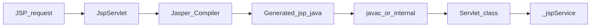
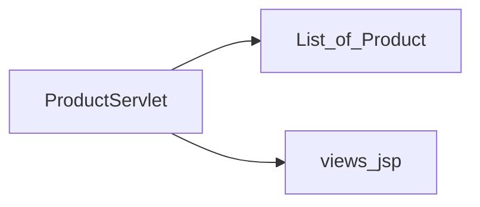

# 第4章 案例二：JSP + EL 商品展示系统（正文初稿）

> 对应总纲：**Tomcat 实战应用** 第二个案例。读完本章，你应能搭出一个 **Servlet 调度 + JSP 视图 + EL 展示** 的最小商城演示，并说清 **Jasper 如何把 JSP 变成 Servlet** 以及 **EL 从哪些作用域取属性**。

---

## 本章导读

- **你要带走的三件事**
  1. **JSP 本质**：JSP 是 **模板**，首次（或变更后）由 **Jasper** 编译成 **`.java` Servlet**，再编译为 `.class` 执行。
  2. **EL 作用域**：`${name}` 等价于按 **`page → request → session → application`** 顺序 **`findAttribute`**（同名靠前者胜出）。
  3. **工程边界**：**Servlet 做调度与取数**，**JSP 只做展示**；业务逻辑尽量不进 JSP（少 Scriptlet，多用 EL + JSTL）。

- **阅读建议**：先跑通「列表 → 详情 → 搜索」三条 URL，再在 `work` 目录里找到 **生成的 `*_jsp.java`** 对照阅读。

---

## 4.1 案例目标

1. 使用 **JSP + EL**（可选 **JSTL**）实现：**商品列表、商品详情、关键词搜索**。
2. 理解 **JSP 编译、类加载、`service` 调用** 全链路，能在 Tomcat 日志里识别 **JSP 编译错误**。
3. 产出：**可部署的 WAR 结构说明** + **「JSP 渲染链路排错单」**。

---

## 4.2 核心问题

### 4.2.1 JSP 为什么会被编译成 Servlet？

- Servlet 规范定义的 **输出模型** 是面向 **`HttpServletResponse.getWriter()`** 等 API 的 **Java 代码**。
- JSP 允许在 HTML 中嵌入 Java/标签；容器实现（Tomcat **Jasper**）必须在运行时把 JSP **翻译** 为 **Java 源文件**（一个继承 `HttpJspBase` 的类），再 **javac 编译**、**加载**、**实例化**，最后走 **`_jspService`**，效果等价于「手写一个往页面里 `print` 的 Servlet」。

**直觉**：JSP = **编译期/运行期代码生成器** + **模板缓存**。

### 4.2.2 EL 解析与作用域查找顺序

- **EL**：`${product.name}` 由容器在 **运行时** 解析（JSP 编译结果里会生成对应 **取值/调用 getter** 的 Java 代码）。
- **`pageContext.findAttribute("x")` 顺序**（JSP 2.x 常见语义）：
  1. `page`
  2. `request`
  3. `session`（若当前页面 `session` 有效）
  4. `application`（`ServletContext`）

**注意**：

- 显式指定作用域可避免歧义，例如 JSTL：`<c:out value="${requestScope.product}" />`（本章选做）。
- **同名属性** 在多个作用域存在时，**先找到的优先**。

### 图示建议

**图 4-1：JSP 首次访问时的 Jasper 链路（简化）**



**图 4-2：MVC 边界（本案例约定）**



---

## 4.3 源码锚点

| 类 | 读什么 |
|----|--------|
| `org.apache.jasper.servlet.JspServlet` | JSP 请求入口：定位 JSP 文件、触发编译/加载 |
| `org.apache.jasper.compiler.Compiler` | 编译管线：解析 JSP → 生成 Java 源 |
| `org.apache.jasper.runtime.PageContextImpl` | `findAttribute`、包含/转发、各种 scope 的实际支撑 |

**读法提示**：

1. 在 `JspServlet` 里跟 **一次 `.jsp` 请求**，找到 **何时调用 Compiler**、**生成的 servlet 类名规则**。
2. 打开 **`TOMCAT_HOME/work/Catalina/localhost/<context>/org/apache/jsp/...jsp.java`**，对照原 JSP 看 **哪些 EL 变成了什么 Java 代码**。

---

## 4.4 工程化要点

### 4.4.1 MVC 边界

| 层 | 职责 | 本案例放置 |
|----|------|------------|
| **Controller** | 解析参数、调用「数据访问」、选视图、`forward` | `ProductServlet` |
| **Model** | 领域对象、内存列表（教学可不用数据库） | `Product` JavaBean |
| **View** | 展示、循环、格式化 | `WEB-INF/jsp/*.jsp`（禁止浏览器直接访问） |

**原则**：JSP 内 **不写 JDBC**、不写复杂 `if/业务分支`；必要时只用 **JSTL** 做展示层分支。

### 4.4.2 防止脚本化污染

- **避免** `<% %>` Scriptlet 堆砌业务逻辑。
- **优先** `${}` EL 访问 **getter**（如 `getName()` → `${product.name}`）。
- **循环列表**：推荐 `JSTL <c:forEach>`；若暂不引入 JSTL，可用 **Servlet 里拼 DTO** + JSP 只展示单页（教学降级方案）。

### 4.4.3 性能与运维

- **首次访问慢**：JSP **编译 + 类加载**；生产可 **预热**（启动后脚本访问关键页）。
- **开发期热替换**：依赖 IDE/部署方式；生产通常 **整 Context 重载** 或 **发布新 WAR**。
- **编码**：统一 **UTF-8**：`page` 指令 `contentType`、IDE 文件编码、`Connector` URIEncoding（含中文参数时）。

---

## 4.5 实战：目录结构与示例代码

以下示例使用 **纯 Servlet + JSP + EL**，依赖最小；Context path 假设为 `/shop`（可按需改为 `/`）。

### 4.5.1 WAR 目录结构

```text
shop.war
├── WEB-INF
│   ├── web.xml
│   ├── classes
│   │   └── com/example/shop/
│   │       ├── Product.java
│   │       ├── ProductRepository.java
│   │       └── ProductServlet.java
│   └── jsp
│       ├── list.jsp
│       ├── detail.jsp
│       └── search.jsp
└── index.jsp   （可选：仅重定向到 /products）
```

### 4.5.2 Model：`Product.java`

```java
package com.example.shop;

import java.io.Serializable;
import java.math.BigDecimal;

public class Product implements Serializable {
    private static final long serialVersionUID = 1L;
    private final String id;
    private final String name;
    private final BigDecimal price;
    private final String description;

    public Product(String id, String name, BigDecimal price, String description) {
        this.id = id;
        this.name = name;
        this.price = price;
        this.description = description;
    }

    public String getId() { return id; }
    public String getName() { return name; }
    public BigDecimal getPrice() { return price; }
    public String getDescription() { return description; }
}
```

### 4.5.3 内存「仓库」：`ProductRepository.java`

```java
package com.example.shop;

import java.math.BigDecimal;
import java.util.*;
import java.util.stream.Collectors;

public class ProductRepository {
    private static final List<Product> ALL = Arrays.asList(
        new Product("p1", "机械键盘", new BigDecimal("399.00"), "红轴 87 键"),
        new Product("p2", "显示器", new BigDecimal("1299.00"), "27 寸 2K"),
        new Product("p3", "鼠标", new BigDecimal("199.00"), "无线轻量化")
    );

    public List<Product> findAll() {
        return Collections.unmodifiableList(ALL);
    }

    public Optional<Product> findById(String id) {
        return ALL.stream().filter(p -> p.getId().equals(id)).findFirst();
    }

    public List<Product> searchByName(String keyword) {
        if (keyword == null || keyword.isBlank()) {
            return findAll();
        }
        String k = keyword.trim().toLowerCase(Locale.ROOT);
        return ALL.stream()
            .filter(p -> p.getName().toLowerCase(Locale.ROOT).contains(k))
            .collect(Collectors.toList());
    }
}
```

### 4.5.4 Controller：`ProductServlet.java`

```java
package com.example.shop;

import javax.servlet.ServletException;
import javax.servlet.annotation.WebServlet;
import javax.servlet.http.HttpServlet;
import javax.servlet.http.HttpServletRequest;
import javax.servlet.http.HttpServletResponse;
import java.io.IOException;

@WebServlet(name = "ProductServlet", urlPatterns = "/products")
public class ProductServlet extends HttpServlet {

    private final ProductRepository repository = new ProductRepository();

    @Override
    protected void doGet(HttpServletRequest req, HttpServletResponse resp)
            throws ServletException, IOException {
        String path = req.getPathInfo(); // 可能为 null、 "/"、"/p1"、"/search"

        if (path == null || "/".equals(path)) {
            req.setAttribute("products", repository.findAll());
            req.getRequestDispatcher("/WEB-INF/jsp/list.jsp").forward(req, resp);
            return;
        }

        if (path.startsWith("/search")) {
            String q = req.getParameter("q");
            req.setAttribute("products", repository.searchByName(q));
            req.setAttribute("keyword", q == null ? "" : q);
            req.getRequestDispatcher("/WEB-INF/jsp/search.jsp").forward(req, resp);
            return;
        }

        String id = path.startsWith("/") ? path.substring(1) : path;
        repository.findById(id).ifPresentOrElse(
            p -> {
                req.setAttribute("product", p);
                try {
                    req.getRequestDispatcher("/WEB-INF/jsp/detail.jsp").forward(req, resp);
                } catch (ServletException | IOException e) {
                    throw new RuntimeException(e);
                }
            },
            () -> {
                try {
                    resp.sendError(HttpServletResponse.SC_NOT_FOUND, "商品不存在");
                } catch (IOException e) {
                    throw new RuntimeException(e);
                }
            }
        );
    }
}
```

**访问示例**（Context `/shop`）：

- 列表：`http://localhost:8080/shop/products`
- 详情：`http://localhost:8080/shop/products/p1`
- 搜索：`http://localhost:8080/shop/products/search?q=键`

> 若使用 **Tomcat 10+ / Jakarta EE 9+**，将 `javax.servlet` 改为 `jakarta.servlet`，包名一致即可。

### 4.5.5 视图：`list.jsp`

```jsp
<%@ page contentType="text/html;charset=UTF-8" pageEncoding="UTF-8" %>
<%@ page import="java.util.List" %>
<%@ page import="com.example.shop.Product" %>
<!DOCTYPE html>
<html>
<head>
  <title>商品列表</title>
</head>
<body>
<h1>商品列表</h1>
<p><a href="products/search?q=">搜索</a></p>
<ul>
<%-- 依赖 request.setAttribute("products", List<Product>) --%>
<%
  @SuppressWarnings("unchecked")
  List<Product> products = (List<Product>) request.getAttribute("products");
  if (products != null) {
    for (Product p : products) {
%>
  <li>
    <%-- 注意：Scriptlet 里的局部变量 p 不会自动进 EL；此处用表达式输出，或改用 JSTL forEach + ${p.id} --%>
    <a href="products/<%= p.getId() %>"><%= p.getName() %></a> — <%= p.getPrice() %> 元
  </li>
<%
    }
  }
%>
</ul>
</body>
</html>
```

**说明**：无 JSTL 时，循环内展示用 **`<%= %>`**；若要用 **`${p.name}`**，应使用 **`<c:forEach items="${products}" var="p">`**，让容器把当前元素放进 **page 作用域** 的 `p`。

### 4.5.6 视图：`detail.jsp`

```jsp
<%@ page contentType="text/html;charset=UTF-8" pageEncoding="UTF-8" %>
<!DOCTYPE html>
<html>
<head>
  <title>${product.name}</title>
</head>
<body>
<p><a href="${pageContext.request.contextPath}/products">返回列表</a></p>
<h1>${product.name}</h1>
<p>价格：<strong>${product.price}</strong> 元</p>
<p>${product.description}</p>
</body>
</html>
```

### 4.5.7 视图：`search.jsp`

```jsp
<%@ page contentType="text/html;charset=UTF-8" pageEncoding="UTF-8" %>
<%@ page import="java.util.List" %>
<%@ page import="com.example.shop.Product" %>
<!DOCTYPE html>
<html>
<head>
  <title>搜索商品</title>
</head>
<body>
<h1>搜索</h1>
<form method="get" action="${pageContext.request.contextPath}/products/search">
  <input type="text" name="q" value="${keyword}"/>
  <button type="submit">搜索</button>
</form>
<ul>
<%
  @SuppressWarnings("unchecked")
  List<Product> products = (List<Product>) request.getAttribute("products");
  if (products != null) {
    for (Product p : products) {
%>
  <li><a href="../<%= p.getId() %>"><%= p.getName() %></a> — <%= p.getPrice() %></li>
<%
    }
  }
%>
</ul>
</body>
</html>
```

**注意**：`search.jsp` 中链接使用相对路径 `../${p.id}` 依赖当前 URL 为 `.../products/search`；更稳妥写法是用 **`${pageContext.request.contextPath}/products/${p.id}`**（建议你作业里改掉）。

### 4.5.8 `web.xml`（若不用注解）

```xml
<?xml version="1.0" encoding="UTF-8"?>
<web-app xmlns="https://jakarta.ee/xml/ns/jakartaee"
         xmlns:xsi="http://www.w3.org/2001/XMLSchema-instance"
         xsi:schemaLocation="https://jakarta.ee/xml/ns/jakartaee
         https://jakarta.ee/xml/ns/jakartaee/web-app_6_0.xsd"
         version="6.0">
  <display-name>shop</display-name>
  <welcome-file-list>
    <welcome-file>index.jsp</welcome-file>
  </welcome-file-list>
</web-app>
```

> 若仍用 **Java EE 8 / javax**，将 `web-app` 头改为对应 `http://xmlns.jcp.org/xml/ns/javaee` 与 `version="4.0"`。

---

## 4.6 「JSP 渲染链路排错单」

| 现象 | 可能原因 | 处理 |
|------|----------|------|
| 500，日志有 `JasperException`、某行 JSP | EL 写错、属性为 null 未兜底、指令缺失 | 看 **JSP 行号**；检查 `setAttribute` 名与 EL 是否一致 |
| 页面中文乱码 | 文件编码非 UTF-8 或未设 `pageEncoding` | 统一 UTF-8；检查 `contentType` |
| `${xxx}` 原样输出 | EL 被禁用或版本过老 | `web.xml` 中 `jsp-property-group` 检查 `el-ignored`；升级规范 |
| 改 JSP 不生效 | 缓存/work 未更新 | 删 `work` 下对应目录或触发热部署；看是否用了预编译 |
| **找不到属性** | 作用域错了 | 用 `requestScope.x` 显式指定；确认 `forward` 前已 `setAttribute` |
| 详情页 NPE | `product` 未放入 request | Servlet 分支是否未 `forward` 就渲染 |
| `forward` 后浏览器 URL 不变 | 正常行为 | 刷新会重复提交时用 **PRG**（本章扩展） |

---

## 本章小结

- JSP 由 **Jasper** 编译为 **Servlet 类**，核心入口在 **`JspServlet`**，生成类在 **`work`** 目录。
- EL 默认按 **page → request → session → application** 查找；工程上应用 **显式 scope** 与清晰 **MVC** 降低歧义。
- 商品案例演示了 **`/products` + pathInfo** 的 REST 风格路由在 Servlet 中的极简实现。

---

## 自测练习题

1. 为什么在 **Scriptlet** `for (Product p : list)` 循环体里写 `${p.name}` **往往不对**？怎样才能让 `${p.name}` 生效？
2. `${user}` 与 `${requestScope.user}` 在什么情况下结果不同？
3. `forward` 与 `redirect` 对 **JSP 中 `${param.x}`** 分别有什么影响？
4. 为什么 **`WEB-INF` 下的 JSP** 通常更安全？

---

## 课后作业

### 必做

1. 本地部署本案例，提交 **三张截图**：列表、详情、搜索。
2. 在 `work` 目录找到 **`list_jsp.java`**（或等价路径），标出 **一行** 由 `${p.name}` 生成的 Java 代码。
3. 将 `list.jsp` / `search.jsp` 中的 **Scriptlet 循环** 改为 **JSTL `<c:forEach>`**（需引入 `jstl.jar` 与 `standard.jar` 或 Maven 依赖），附 `web.xml` 或 `jsp-config` 片段。

### 选做

1. 增加 **分页**：`?page=1&size=10`，Servlet 计算子列表，JSP 只展示。
2. 实现 **POST-Redirect-GET**：搜索改为 POST 提交后 `redirect` 到 GET，避免刷新重复提交。
3. 在 `Compiler` 或 `JspServlet` 打断点，记录 **首次访问 JSP** 时的 **调用栈前 8 帧**。

---

## 延伸阅读

- Servlet 规范：**JSP 与 EL** 章节（对照版本）。
- Tomcat 文档：**Jasper** 配置（`development`、`checkInterval` 等与开发/生产相关）。

---

*本稿为专栏第4章初稿，可与总纲 [`专栏.md`](专栏.md) 对照使用。*
