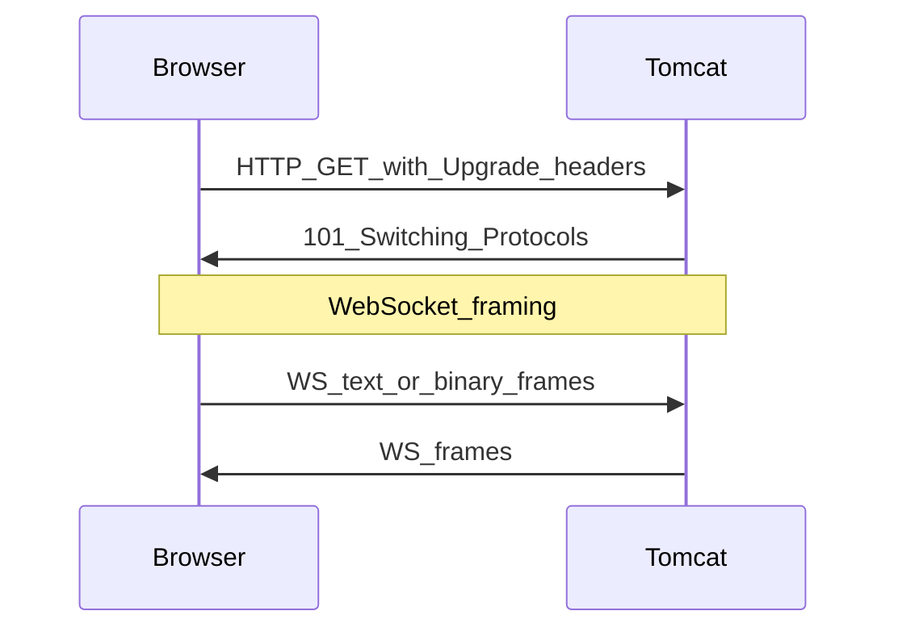
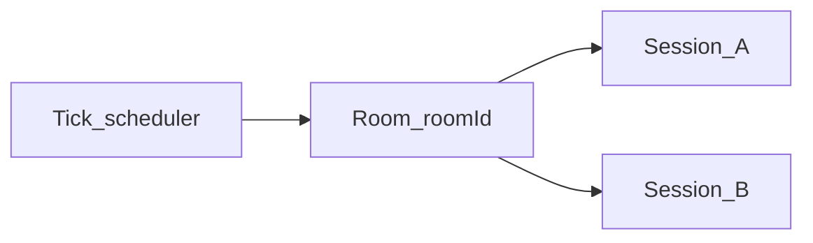

# 第5章 案例三：基于 WebSocket 的贪吃蛇（正文初稿）

> 对应总纲：**Tomcat 实战应用** 第三个案例。读完本章，你应能部署一个 **按房间划分** 的多人贪吃蛇 Demo，理解 **HTTP Upgrade → WebSocket** 在 Tomcat 中的落点，并掌握 **连接生命周期、广播、心跳与异常** 的基本工程化手段。  
> **包名说明**：Tomcat 10+ / Jakarta EE 9+ 使用 `jakarta.websocket.*`；下文示例以 **`javax.websocket.*`** 书写，若你环境为 Tomcat 10，请全局替换为 **`jakarta`**。

---

## 本章导读

- **你要带走的三件事**
  1. **握手**：WebSocket 先走 **HTTP/1.1**，通过 **`Upgrade: websocket`** 与 **`Sec-WebSocket-*`** 头完成协议切换，之后才是 **帧** 传输。
  2. **Tomcat 侧**：升级由 **`WsHttpUpgradeHandler`** 等组件承接；端点由 **`ServerContainer`** 扫描/注册 **`@ServerEndpoint`**。
  3. **工程**：长连接要单独考虑 **会话表、房间广播、慢客户端、断线重连、心跳**；不能像短 HTTP 一样「发完就忘」。

- **阅读建议**：先跑通 **单房间两人**，再开两个浏览器标签进 **不同 roomId**，观察广播隔离；最后做 **断网重连** 演练。

---

## 5.1 案例目标

1. 在 Tomcat 上实现 **多人、多房间** 贪吃蛇：**同一 `roomId` 内玩家共享一局状态**，不同房间互不影响。
2. 能说清 **Upgrade 握手** 与 **Tomcat WebSocket 容器** 的关系。
3. 产出：**可运行 WAR + HTML 客户端** + **「WebSocket 故障演练清单」**。

---

## 5.2 核心问题

### 5.2.1 连接生命周期与房间广播

- **`Session`（`javax.websocket.Session`）** 代表一条 WebSocket 连接；`@OnOpen` / `@OnClose` / `@OnError` 是生命周期三钩子。
- **房间模型**：`roomId -> Set<Session>`（或 `roomId -> Room` 对象内聚游戏状态与定时器）。
- **广播**：遍历房间内 `Session`，`session.getBasicRemote().sendText(...)`（同步）或 **`AsyncRemote`**（异步）；需处理 **已关闭 Session** 与 **IOException**。

### 5.2.2 背压、慢客户端、重连

| 问题 | 说明 | 常见手段 |
|------|------|----------|
| **背压** | 服务端 `send` 快于客户端消费，缓冲区堆积 | 限制广播频率、丢弃非关键帧、用 **异步发送 + 完成回调** 检测失败 |
| **慢客户端** | 单点阻塞影响全局 | 房间隔离、单连接发送失败 **移除会话**、记录指标 |
| **重连** | 网络抖动、页面刷新 | 客户端 **指数退避** 重连；服务端 **新 Session 新 id**，状态可「重新加入」或「观战」 |

### 5.2.3 心跳保活

- **目的**：穿过 **NAT/代理** 的空闲超时；检测 **半开连接**。
- **做法**：客户端定时发 **`ping` 消息**（应用层 JSON），或服务端 **`@OnMessage` 允许 PongFrame**（视 API）；Tomcat 底层也有 **WebSocket 协议级 ping/pong**，需在客户端与中间件上验证是否被剥离。

---

## 5.3 源码锚点（Tomcat）

| 类 | 读什么 |
|----|--------|
| `org.apache.tomcat.websocket.server.WsHttpUpgradeHandler` | HTTP 请求 **Upgrade** 后，如何切换到 WebSocket 读写管道 |
| `org.apache.tomcat.websocket.server.WsServerContainer` | **ServerEndpoint** 注册、路径匹配、与 Servlet 容器协作 |
| `javax.websocket.Session` | **连接维度** API：`BasicRemote` / `AsyncRemote`、id、参数 Map |

**读法提示**：在 `WsServerContainer` 中找 **`addEndpoint` / 扫描注解** 相关逻辑；在 Upgrade 路径上对照 **第2章** 的 Connector → Processor，理解 **「同端口、后半程不同协议」**。

---

## 5.4 工程化要点

1. **线程安全**：房间状态用 **`ConcurrentHashMap`**、会话集合用 **`ConcurrentHashMap.newKeySet()`** 或 **`CopyOnWriteArraySet`**（读多写少时）。
2. **游戏循环**：**单线程定时任务** 驱动每帧（`ScheduledExecutorService`），避免多线程同时改蛇身。
3. **消息格式**：统一 **JSON**，类型字段 `type`：`join`、`dir`、`tick`、`ping`。
4. **错误隔离**：某个 `sendText` 失败只 **移除该 Session**，不要拖垮整房间循环。
5. **资源回收**：房间 **最后一个玩家离开** 时 **cancel 定时任务**，防止泄漏。

---

## 5.5 图示建议

**图 5-1：HTTP Upgrade 到 WebSocket（概念时序）**



**图 5-2：房间广播**



---

## 5.6 实战：WAR 结构与依赖

```text
snake.war
├── WEB-INF
│   ├── classes
│   │   └── com/example/snake/
│   │       ├── SnakeEndpoint.java
│   │       ├── GameRoom.java
│   │       ├── GameState.java
│   │       └── JsonUtil.java
│   └── web.xml（可选用注解则最简）
└── snake.html
```

- **Tomcat 自带** WebSocket 实现与 API，一般 **无需** 额外拷贝 `websocket-api.jar` 到 WAR（以你使用的 Tomcat 版本文档为准）。
- 若使用 **嵌入式** 或 **非完整 Tomcat**，需按文档补齐 API 与实现 Jar。

---

## 5.7 服务端核心代码（教学精简版）

以下逻辑为 **最小可运行骨架**：固定网格、每条蛇 3 格起步、撞墙或撞他人身体则重置为 3 格随机空位；**同一 `roomId` 共享食物**。生产级需补：鉴权、防作弊、更严谨碰撞与输入队列。

### 5.7.1 `JsonUtil.java`（无第三方 JSON）

```java
package com.example.snake;

import java.util.*;

public final class JsonUtil {
    private JsonUtil() {}

    public static String esc(String s) {
        if (s == null) return "";
        return s.replace("\\", "\\\\").replace("\"", "\\\"");
    }

    /** 简单 state：food + 每条蛇 id、body 数组 [[x,y],...] */
    public static String stateMessage(int foodX, int foodY,
                                      List<Snake> snakes) {
        StringBuilder sb = new StringBuilder(256);
        sb.append("{\"type\":\"tick\",\"food\":{\"x\":").append(foodX)
          .append(",\"y\":").append(foodY).append("},\"snakes\":[");
        for (int i = 0; i < snakes.size(); i++) {
            if (i > 0) sb.append(',');
            Snake s = snakes.get(i);
            sb.append("{\"id\":\"").append(esc(s.id)).append("\",\"name\":\"")
              .append(esc(s.name)).append("\",\"body\":[");
            for (int j = 0; j < s.body.size(); j++) {
                int[] p = s.body.get(j);
                if (j > 0) sb.append(',');
                sb.append('[').append(p[0]).append(',').append(p[1]).append(']');
            }
            sb.append("]}");
        }
        sb.append("]}");
        return sb.toString();
    }
}
```

### 5.7.2 `GameState.java` / `Snake` / `GameRoom.java`

```java
package com.example.snake;

import javax.websocket.Session;
import java.util.*;
import java.util.concurrent.*;

public class Snake {
    final String id;
    String name;
    final LinkedList<int[]> body = new LinkedList<>();
    int dx = 1, dy = 0;
    int pendingDx = 1, pendingDy = 0;

    Snake(String id, String name, int x, int y) {
        this.id = id;
        this.name = name;
        body.add(new int[]{x, y});
        body.add(new int[]{x - 1, y});
        body.add(new int[]{x - 2, y});
    }

    void applyPendingDir() {
        if (pendingDx != -dx || pendingDy != -dy) {
            dx = pendingDx;
            dy = pendingDy;
        }
    }
}

public class GameState {
    static final int W = 28, H = 20;
    int foodX, foodY;
    final Map<String, Snake> snakes = new LinkedHashMap<>();
    final Random rnd = new Random();

    void spawnFood() {
        for (int k = 0; k < 5000; k++) {
            int x = rnd.nextInt(W), y = rnd.nextInt(H);
            if (!occupied(x, y)) {
                foodX = x; foodY = y; return;
            }
        }
        foodX = 0; foodY = 0;
    }

    boolean occupied(int x, int y) {
        for (Snake s : snakes.values()) {
            for (int[] p : s.body) {
                if (p[0] == x && p[1] == y) return true;
            }
        }
        return false;
    }

    void addSnake(Session session, String name) {
        String id = session.getId();
        for (int k = 0; k < 200; k++) {
            int x = 5 + rnd.nextInt(W - 10), y = 3 + rnd.nextInt(H - 6);
            if (!occupied(x, y)) {
                snakes.put(id, new Snake(id, name == null ? id : name, x, y));
                spawnFood();
                return;
            }
        }
        snakes.put(id, new Snake(id, name == null ? id : name, W / 2, H / 2));
        spawnFood();
    }

    void removeSnake(String sessionId) {
        snakes.remove(sessionId);
    }

    void setDir(String sessionId, int ndx, int ndy) {
        Snake s = snakes.get(sessionId);
        if (s == null) return;
        if (ndx < -1 || ndx > 1 || ndy < -1 || ndy > 1) return;
        if (ndx == 0 && ndy == 0) return;
        if (ndx != 0 && ndy != 0) return;
        s.pendingDx = ndx;
        s.pendingDy = ndy;
    }

    /** 一步模拟：移动、吃食物、碰撞重置 */
    void tick() {
        List<String> resetIds = new ArrayList<>();
        for (Snake s : snakes.values()) {
            s.applyPendingDir();
            int[] head = s.body.getFirst();
            int nx = head[0] + s.dx, ny = head[1] + s.dy;
            if (nx < 0 || ny < 0 || nx >= W || ny >= H) {
                resetIds.add(s.id); continue;
            }
            boolean hitOther = false;
            for (Snake o : snakes.values()) {
                for (int[] p : o.body) {
                    if (p[0] == nx && p[1] == ny && !(o == s && p == head)) {
                        hitOther = true; break;
                    }
                }
                if (hitOther) break;
            }
            if (hitOther) { resetIds.add(s.id); continue; }

            s.body.addFirst(new int[]{nx, ny});
            if (nx == foodX && ny == foodY) {
                spawnFood();
            } else {
                s.body.removeLast();
            }
        }
        for (String id : resetIds) {
            snakes.remove(id);
            Session sess = GameRoom.SESSION_BY_ID.get(id);
            if (sess != null && sess.isOpen()) {
                addSnake(sess, "reborn");
            }
        }
    }

    List<Snake> snakeList() {
        return new ArrayList<>(snakes.values());
    }
}

public class GameRoom {
    static final ConcurrentHashMap<String, Session> SESSION_BY_ID = new ConcurrentHashMap<>();
    private static final ConcurrentHashMap<String, GameRoom> ROOMS = new ConcurrentHashMap<>();

    final String roomId;
    final GameState state = new GameState();
    final Set<Session> sessions = ConcurrentHashMap.newKeySet();
    final ScheduledExecutorService scheduler = Executors.newSingleThreadScheduledExecutor(r -> {
        Thread t = new Thread(r, "snake-tick-" + roomId);
        t.setDaemon(true);
        return t;
    });
    ScheduledFuture<?> tickTask;

    GameRoom(String roomId) {
        this.roomId = roomId;
        state.spawnFood();
    }

    static GameRoom getOrCreate(String roomId) {
        return ROOMS.computeIfAbsent(roomId, GameRoom::new);
    }

    static void removeIfEmpty(String roomId) {
        GameRoom r = ROOMS.get(roomId);
        if (r != null && r.sessions.isEmpty()) {
            ROOMS.remove(roomId, r);
            if (r.tickTask != null) r.tickTask.cancel(false);
            r.scheduler.shutdownNow();
        }
    }

    synchronized void join(Session session, String name) {
        if (!sessions.contains(session)) {
            sessions.add(session);
            SESSION_BY_ID.put(session.getId(), session);
            state.addSnake(session, name);
            if (tickTask == null || tickTask.isCancelled()) {
                tickTask = scheduler.scheduleAtFixedRate(this::safeTick, 200, 200, TimeUnit.MILLISECONDS);
            }
        } else if (name != null) {
            Snake s = state.snakes.get(session.getId());
            if (s != null) s.name = name;
        }
        broadcast(JsonUtil.stateMessage(state.foodX, state.foodY, state.snakeList()));
    }

    synchronized void leave(Session session) {
        sessions.remove(session);
        SESSION_BY_ID.remove(session.getId());
        state.removeSnake(session.getId());
        if (sessions.isEmpty()) {
            if (tickTask != null) tickTask.cancel(false);
            scheduler.shutdownNow();
            ROOMS.remove(roomId, this);
        } else {
            broadcast(JsonUtil.stateMessage(state.foodX, state.foodY, state.snakeList()));
        }
    }

    void onDir(Session session, int dx, int dy) {
        state.setDir(session.getId(), dx, dy);
    }

    void safeTick() {
        try {
            tick();
        } catch (Exception e) {
            e.printStackTrace();
        }
    }

    synchronized void tick() {
        state.tick();
        broadcast(JsonUtil.stateMessage(state.foodX, state.foodY, state.snakeList()));
    }

    void broadcast(String text) {
        for (Session s : new ArrayList<>(sessions)) {
            if (!s.isOpen()) continue;
            try {
                s.getBasicRemote().sendText(text);
            } catch (Exception e) {
                leave(s);
            }
        }
    }
}
```

**说明**：`GameState.tick` 里通过 `SESSION_BY_ID` 重生蛇会造成与 `SnakeEndpoint` 的耦合，教学上可接受；你可作业改为 **Room 持有 session→name 映射** 消除静态表。

### 5.7.3 `SnakeEndpoint.java`

```java
package com.example.snake;

import javax.websocket.*;
import javax.websocket.server.PathParam;
import javax.websocket.server.ServerEndpoint;

@ServerEndpoint("/ws/snake/{roomId}")
public class SnakeEndpoint {

    private String roomId;
    private Session session;
    /** 未收到 join 就断开时，避免 getOrCreate 出空房间泄漏 */
    private volatile boolean joined;

    @OnOpen
    public void onOpen(Session session, @PathParam("roomId") String roomId) {
        this.session = session;
        this.roomId = roomId == null ? "default" : roomId;
        // 不在此加入游戏，避免与 onMessage 的 join 重复创建两条蛇；等客户端首包 join
    }

    @OnMessage
    public void onMessage(String msg) {
        if (msg == null) return;
        String m = msg.trim();
        if (m.contains("\"type\":\"ping\"")) {
            try {
                session.getBasicRemote().sendText("{\"type\":\"pong\"}");
            } catch (Exception ignored) { }
            return;
        }
        if (m.contains("\"type\":\"join\"")) {
            String name = extractString(m, "name");
            joined = true;
            GameRoom.getOrCreate(roomId).join(session, name);
            return;
        }
        if (m.contains("\"type\":\"dir\"")) {
            int dx = extractInt(m, "dx", 0);
            int dy = extractInt(m, "dy", 0);
            GameRoom.getOrCreate(roomId).onDir(session, dx, dy);
        }
    }

    @OnClose
    public void onClose() {
        if (!joined) return;
        GameRoom.getOrCreate(roomId).leave(session);
        GameRoom.removeIfEmpty(roomId);
    }

    @OnError
    public void onError(Throwable t) {
        if (!joined) return;
        GameRoom.getOrCreate(roomId).leave(session);
        GameRoom.removeIfEmpty(roomId);
    }

    private static String extractString(String json, String key) {
        String k = "\"" + key + "\":\"";
        int i = json.indexOf(k);
        if (i < 0) return null;
        int from = i + k.length();
        int j = json.indexOf('"', from);
        if (j < 0) return null;
        return json.substring(from, j);
    }

    private static int extractInt(String json, String key, int def) {
        String k = "\"" + key + "\":";
        int i = json.indexOf(k);
        if (i < 0) return def;
        int from = i + k.length();
        int j = from;
        while (j < json.length() && (Character.isDigit(json.charAt(j)) || json.charAt(j) == '-')) j++;
        try {
            return Integer.parseInt(json.substring(from, j));
        } catch (Exception e) {
            return def;
        }
    }
}
```

**部署注意**：`@ServerEndpoint` 类必须在 **`WEB-INF/classes`** 且能被 Tomcat 扫描；若未生效，检查 **`web.xml` metadata-complete** 或显式 **`ServerApplicationConfig`**（进阶）。

---

## 5.8 客户端 `snake.html`（Canvas + 重连）

将下面文件放到 WAR 根目录，按你的 **context path** 修改 `WS_URL`（示例为 `/snake` 应用、`room1` 房间）。

```html
<!DOCTYPE html>
<html>
<head>
  <meta charset="UTF-8"/>
  <title>Snake WebSocket</title>
  <style>body{font-family:sans-serif;} canvas{border:1px solid #333;}</style>
</head>
<body>
<h1>贪吃蛇（WebSocket）</h1>
<label>名字 <input id="name" value="player"/></label>
<button id="btn">连接</button>
<span id="st"></span>
<canvas id="c" width="560" height="400"></canvas>
<script>
  const CELL = 20, W = 28, H = 20;
  const ctx = document.getElementById('c').getContext('2d');
  const st = document.getElementById('st');
  const WS_URL = (location.protocol === 'https:' ? 'wss://' : 'ws://')
      + location.host + '/snake/ws/snake/room1';

  let ws = null;
  let backoff = 500;
  let pingTimer = null;

  function connect() {
    st.textContent = 'connecting...';
    ws = new WebSocket(WS_URL);
    ws.onopen = () => {
      st.textContent = 'open';
      backoff = 500;
      const name = document.getElementById('name').value || 'player';
      ws.send(JSON.stringify({type:'join', name}));
      if (pingTimer) clearInterval(pingTimer);
      pingTimer = setInterval(() => {
        if (ws && ws.readyState === WebSocket.OPEN)
          ws.send(JSON.stringify({type:'ping'}));
      }, 20000);
    };
    ws.onclose = () => {
      st.textContent = 'closed, retry...';
      setTimeout(connect, backoff);
      backoff = Math.min(backoff * 2, 8000);
    };
    ws.onerror = () => { st.textContent = 'error'; };
    ws.onmessage = (ev) => {
      let o;
      try { o = JSON.parse(ev.data); } catch (e) { return; }
      if (o.type !== 'tick') return;
      draw(o);
    };
  }

  function draw(o) {
    ctx.fillStyle = '#111';
    ctx.fillRect(0,0,CELL*W,CELL*H);
    ctx.fillStyle = '#0a0';
    ctx.fillRect(o.food.x*CELL, o.food.y*CELL, CELL-1, CELL-1);
    for (const s of o.snakes) {
      ctx.fillStyle = s.id === (ws && ws.extensions) ? '#08f' : '#c66';
      for (const p of s.body) {
        ctx.fillRect(p[0]*CELL, p[1]*CELL, CELL-1, CELL-1);
      }
    }
  }

  document.addEventListener('keydown', e => {
    if (!ws || ws.readyState !== WebSocket.OPEN) return;
    let dx = 0, dy = 0;
    if (e.key === 'ArrowUp') dy = -1;
    else if (e.key === 'ArrowDown') dy = 1;
    else if (e.key === 'ArrowLeft') dx = -1;
    else if (e.key === 'ArrowRight') dx = 1;
    else return;
    e.preventDefault();
    ws.send(JSON.stringify({type:'dir', dx, dy}));
  });

  document.getElementById('btn').onclick = () => connect();
</script>
</body>
</html>
```

**说明**：画布颜色区分「自己与他人」的示例写得不严谨（`ws.extensions` 仅为占位）；**作业**可改为服务端在 `tick` 里带上 **`you: sessionId`** 或单独发 `welcome` 消息告知本机 id。

---

## 5.9 「WebSocket 故障演练清单」

| 演练项 | 操作 | 期望现象 | 若异常，检查 |
|--------|------|----------|--------------|
| 断网 | 拔网线 / 关 Wi-Fi 5s | 客户端重连；服务端 `OnClose`/`OnError` 清理 | 房间定时器是否泄漏 |
| 抖动 | Chrome DevTools → Network → Offline 切换 | 重连后仍能收 `tick` | 客户端退避是否过短打爆服务端 |
| 刷新页 | F5 | 新 Session，蛇重生 | `SESSION_BY_ID` 与旧会话是否残留 |
| 双开 | 同 room 两标签 | 两条蛇、一份食物 | 广播是否只发本 room |
| 慢客户端 | 断点卡住 `onmessage` | 服务端不应永久阻塞 tick 线程 | 是否用了同步发送且未超时处理 |
| 代理 | 经 Nginx 反代 | 需 `proxy_http_version 1.1`、`Upgrade`、`Connection` | 见 Nginx WebSocket 文档 |

---

## 本章小结

- WebSocket 在 Tomcat 中依赖 **Upgrade 处理** 与 **`ServerContainer` 管理端点**。
- 多人实时玩法核心是 **房间状态机 + 单线程 tick + 安全广播**。
- 生产环境需补：**鉴权、消息大小限制、监控指标、优雅下线**。

---

## 自测练习题

1. **`@ServerEndpoint` 与 Servlet 在「线程模型」上的常见区别是什么？**
2. **`BasicRemote.sendText` 与 `AsyncRemote.sendText` 各适合什么场景？**
3. 为什么 **游戏循环** 不建议用 **`@OnMessage` 每消息推进一步**？（从公平性与输入频率思考）

---

## 课后作业

### 必做

1. 部署本 Demo，提交 **同房间两浏览器** 同时运行截图 + **不同 roomId 互不干扰** 的文字说明。
2. 在 `WsHttpUpgradeHandler` 或 `WsServerContainer` 任选一个类，阅读 **类级 JavaDoc 或 `service` 入口附近 50 行**，写 200 字摘要。
3. 完成 **故障演练清单** 中任意 **3 项**，各写 1 行现象记录。

### 选做

1. 改为 **`AsyncRemote` 发送** + 发送失败监听，对比 **同步发送** 在慢客户端下的差异。
2. 增加 **简单鉴权**：握手查询参数 `?token=`，无效则 `close`。
3. 预习第6章：列出你会监控的 **3 个 WebSocket 相关指标**（如连接数、消息速率、房间 tick 耗时）。

---

## 延伸阅读

- JSR 356 规范（**Annotated ServerEndpoint**）。
- Tomcat 文档：**WebSocket How-To**、反向代理下的 **Upgrade** 配置。

---

*本稿为专栏第5章初稿，可与总纲 [`专栏.md`](专栏.md) 对照使用。*
