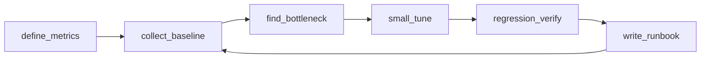
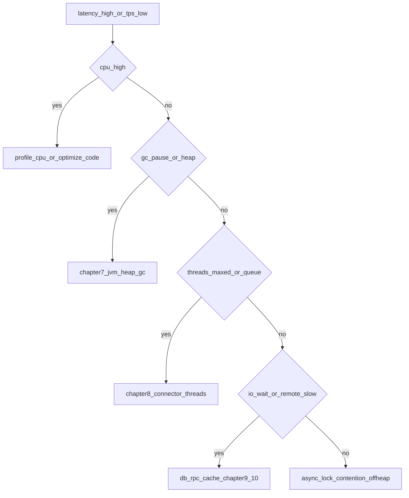

# 第6章 调优方法论：先测量，再定位，再调参（正文初稿）

> 对应总纲：**驯兽师修炼** 的开篇章。Tomcat 调优最怕「抄参数」：本章给你一套 **可复用的工程流程**，后面第 7～11 章的 JVM、Connector、缓存、日志、连接池、集群，都 **嵌在同一套模板里** 展开。

---

## 本章导读

- **你要带走的三件事**
  1. **先测量**：没有基线就没有「优化」；只有 **对比实验** 才能证明有效。
  2. **再定位**：把问题归类到 **CPU / 内存与 GC / IO 等待 / 线程与队列 / 应用逻辑** 之一或组合。
  3. **再调参**：**一次只改一个主要变量**，改完必须 **回归压测 + 可回滚**。

- **阅读建议**：先读完 **6.1～6.2**，用 **6.5 的空白模板** 对你当前项目做一次「纸面演练」，再进入第7章。

---

## 6.1 调优总流程

### 6.1.1 六步法（背下来）

```text
指标定义 → 采集基线 → 发现瓶颈 → 小步调参 → 回归验证 → 沉淀手册
```

| 步骤 | 你要回答的问题 | 常见产出 |
|------|----------------|----------|
| **1. 指标定义** | 业务上什么叫「够快、够稳」？SLO 是什么？ | RT 分位、错误率、吞吐、并发上限 |
| **2. 采集基线** | 「现在」在正常负载下表现如何？ | 压测报告、监控截图、GC 日志片段 |
| **3. 发现瓶颈** | 时间花在哪儿？排队在哪儿？什么资源饱和？ | 火焰图/线程栈、JMX、access log |
| **4. 小步调参** | 最小改动是什么？预期影响哪类指标？ | 变更单（1 个主变量 + 回滚方案） |
| **5. 回归验证** | 优化有没有副作用？其它场景是否退化？ | 对比表：优化前 vs 后 |
| **6. 沉淀手册** | 半年后你还记得吗？新人能照做吗？ | Runbook：参数、范围、风险、回滚 |

### 6.1.2 图示建议

**图 6-1：调优闭环**



### 6.1.3 反模式（不要这样做）

- **无基线直接调 `maxThreads`**：你无法解释「为什么 400 比 200 好」。
- **一次改十个参数**：出问题时无法归因，只能「全部回滚」。
- **只在开发机压测**：CPU 核数、磁盘、网络与生产差异巨大。
- **只看平均 RT**：尾部延迟（P95/P99）才是用户体验与熔断点。
- **把 Tomcat 当万能药**：慢 SQL、N+1、同步远程调用，调 Connector 只能缓解排队，治不了根。

---

## 6.2 统一调优模板（每维度的「四段式」）

后面第 7～11 章每一类调优，建议都按下面 **四段** 写满；你也可以把本节复制到团队 Wiki 当 **标准工单**。

### 6.2.1 四段式定义

| 段落 | 含义 | 你要写的内容 |
|------|------|----------------|
| **指标** | 看什么 | RT（P50/P95/P99）、TPS、错误率、CPU、内存、GC、线程数、队列长度… |
| **观察** | 怎么看 | JMX、Tomcat Manager/JMX、access log、`catalina.out`、GC log、arthas、线程 dump、压测工具 |
| **参数** | 调什么 | JVM、`server.xml` Connector、`context.xml`、应用线程池、连接池、日志配置… |
| **风险** | 怎么回滚 | 触发条件（如 P99 变差 20%）、回滚命令、保留旧配置副本、止损阈值 |

### 6.2.2 「黄金信号」与 Tomcat 的映射（推荐）

Google SRE 的 **Latency / Traffic / Errors / Saturation** 可映射为：

| 黄金信号 | Tomcat 侧常见观测 |
|----------|-------------------|
| **Latency** | Access log `%D`（微秒）、应用埋点、网关 RT |
| **Traffic** | QPS、并发连接数、每秒新建连接 |
| **Errors** | HTTP 5xx、4xx 突增、连接被拒绝、`Timeout` |
| **Saturation** | `maxThreads` 打满、`acceptCount` 队列、`CPU run queue`、老年代占用、磁盘 IO wait |

---

## 6.3 基线：怎么采才「可比」

### 6.3.1 压测场景三件套

1. **稳态负载**：目标 QPS 的 70%～80%，持续 10～30 分钟，看 **稳定态** 下的 GC 与线程。
2. **峰值脉冲**：短促 2～5 分钟打到目标峰值，看 **排队、错误、恢复时间**。
3. **背景噪声**（可选）：同机其它进程、日志级别、定时任务，尽量与生产 **一致或显式记录差异**。

### 6.3.2 实验纪律（强烈建议写进团队规范）

- **单一变量**：同一轮对比只改 **一个** 主参数（例如只改 `-Xmx` 或只改 `maxThreads`）。
- **固定种子数据**：数据库行数、缓存是否预热、JSP 是否已编译，要写进报告。
- **预热**：JVM C2 编译、连接池填满、热点缓存加载后再记数。
- **多次采样**：至少 3 轮取中位数，避免偶然抖动。
- **记录环境**：Tomcat 版本、JDK 版本、容器 CPU limit、`-Xmx`、Connector 协议、Linux `ulimit`。

### 6.3.3 基线报告最小字段

```markdown
## 基线信息
- 日期 / 负责人：
- Tomcat & JDK：
- 机器：CPU 核数 / 内存 / 磁盘类型 / 是否容器 limit
- 压测工具与脚本版本：
- 场景描述：URL、混合比例、思考时间（think time）
- 结果：P50/P95/P99、TPS、错误率、CPU%、GC 次数与停顿
```

---

## 6.4 发现瓶颈：决策树（从现象到方向）

下面不是「绝对真理」，是 **排障优先级** 的实用起点。



### 6.4.1 典型现象速查

| 现象 | 优先怀疑 | 下一步 |
|------|----------|--------|
| P99 飙升，CPU 不高 | 线程排队、锁、远程依赖慢 | 线程栈、Arthas、依赖 RT |
| CPU 高，GC 正常 | 热点代码、正则、序列化 | 火焰图、Profiler |
| Full GC 频繁 / STW 长 | 堆太小、泄漏、老年代晋升 | GC log、heap dump（第7章） |
| `Connection refused` / 大量 503 | Connector 队列、`acceptCount`、上游超时 | Connector、LB 超时对齐（第8章） |
| 静态资源慢 | 缓存头、sendfile、CDN | 第9章 |
| 磁盘爆、IO wait 高 | 同步日志、access log 过大 | 第10章 |
| 数据库 `Timeout` | 连接池过小、慢 SQL | 第10章 |

---

## 6.5 调参：小步、可回滚、可验证

### 6.5.1 变更单模板（复制即用）

```markdown
## 调优变更单
- 关联需求 / 事故单：
- 目标指标：例如 P95 < 200ms @ 800 RPS，错误率 < 0.1%

### 变更前（基线）
- 配置快照：（粘贴 JVM / server.xml 相关片段）
- 数据：P50/P95/P99、TPS、错误率、CPU、关键 GC 指标

### 本次变更（仅 1 个主变量）
- 变更项：
- 变更原因（链接到瓶颈证据）：
- 预期影响：

### 回归结果
- 同场景压测数据：
- 副作用（其它接口、内存、启动时间）：

### 回滚
- 回滚条件：
- 回滚操作：（命令 / 配置还原路径）
- 负责人确认签字：（可选）
```

### 6.5.2 止损阈值（示例）

- P99 连续 **5 分钟** 高于基线 **30%** → 自动回滚或切流量。
- 错误率 **> 1%** 持续 **3 分钟** → 回滚。
- Full GC 频率 **> 基线 2 倍** → 暂停上线，先分析 GC log。

（阈值按业务等级调整，写进 Runbook。）

---

## 6.6 观察手段速查（与第7～11章配合）

| 手段 | 适用 | 注意 |
|------|------|------|
| **Access Log** | RT 分布、热点 URL、状态码 | 配置 `%D`、异步写日志 |
| **JMX** | 线程池、会话数、请求计数 | 生产需认证与防火墙 |
| **GC 日志** | 停顿、晋升、元空间 | JDK8 与 JDK11+ 参数不同 |
| **线程 dump** | 死锁、线程打满 | 高负载时 dump 可能停顿 |
| **压测工具** | JMeter、Gatling、wrk、ab | ab 功能简单，复杂场景用 JMeter |

---

## 6.7 与后续章节的关系

| 章节 | 在本章框架中的位置 |
|------|---------------------|
| **第7章 JVM** | 「观察」里看 GC/堆；「参数」里调 `-Xmx`、GC 算法；「风险」里防 OOM 与停顿恶化 |
| **第8章 Connector** | 「观察」里看线程与队列；「参数」里调 `maxThreads`、`acceptCount`、超时 |
| **第9章 缓存与静态资源** | 「观察」里看命中率与带宽；「参数」里缓存与 sendfile |
| **第10章 日志与连接池** | 「观察」里磁盘与池等待；「参数」里异步日志与池大小 |
| **第11章 会话与集群** | 「观察」里会话复制与节点不均衡；「参数」里粘性、Session 后端 |

---

## 本章小结

- 调优是 **闭环工程**：**定义指标 → 基线 → 定位 → 小步调参 → 回归 → 文档化**。
- **四段式模板**（指标 / 观察 / 参数 / 风险）是贯穿第 7～11 章的「脚手架」。
- **决策树**帮你少走弯路：**先分清 CPU、GC、线程排队、IO**，再动 Tomcat 参数。

---

## 自测练习题

1. 为什么 **「一次只改一个主变量」** 比「一次改一组」更科学？若必须改两个，应如何设计实验？
2. **Saturation** 在 Tomcat 里至少举 **3 个** 可观测现象。
3. 若优化后 **TPS 上升 10%** 但 **P99 上升 50%**，这类结果通常能否上线？你会怎么决策？

---

## 课后作业

### 必做

1. 选一个 **真实或实验用** Tomcat 实例，按 **6.3.3** 填写一份 **基线报告**（可小规模压测）。
2. 用 **6.5.1 变更单模板** 做一次 **纸面演练**：假设瓶颈是 `maxThreads` 打满，写出变更与回滚。
3. 画一张 **你们业务** 的「黄金信号 → 具体监控项」对照表（至少 8 行）。

### 选做

1. 打开 JMX（或只读文档），列出 **3 个** 与 Tomcat 相关的 MBean 名称或对象名。
2. 对比 **ab** 与 **JMeter** 各写一个 **缺点**，说明为什么生产级容量规划更信 JMeter/Gatling。
3. 预习第7章：导出 **30 秒 GC 日志**，标出 **Young GC 与 Full GC** 各一行并解释。

---

## 延伸阅读

- Google SRE：**Monitoring Distributed Systems**（黄金信号）。
- Tomcat 官方：**Monitoring and Managing Tomcat**（JMX 与日志）。

---

*本稿为专栏第6章初稿，可与总纲 [`专栏.md`](专栏.md) 及 [`jvm-tuning.md`](jvm-tuning.md) 对照阅读。*
