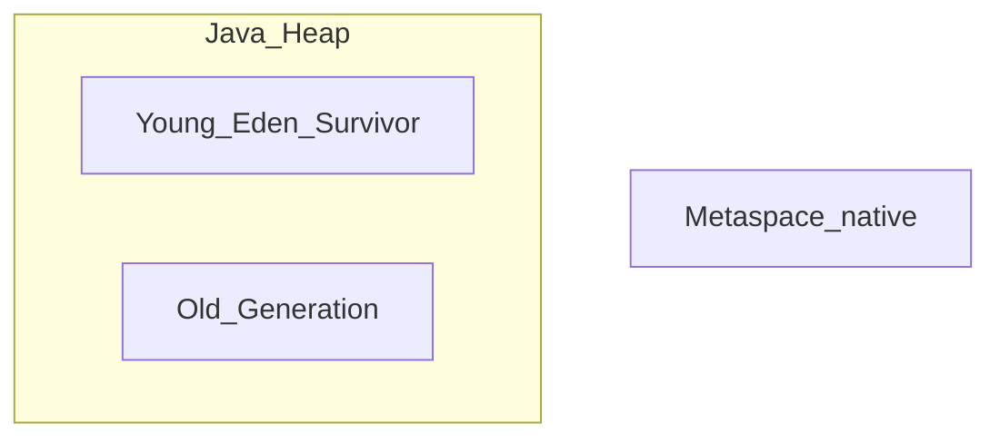
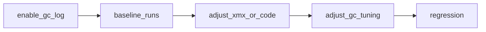

# 第7章 JVM 维度调优（正文初稿）

> 对应总纲：**驯兽师修炼 · JVM**。读完本章，你应能说明 **Tomcat 进程里 JVM 参数从哪注入**、如何按 **第6章** 的「四段式」做堆与 GC 调优，并掌握 **常见 OOM 的定界与工具链**。  
> **版本提示**：JDK 8 与 JDK 11+ 的 **GC 日志参数** 差异很大；JDK 14+ 已移除 **CMS**（`-XX:+UseConcMarkSweepGC`）。下文以 **JDK 11+（LTS）** 为主，JDK 8 处单独标注。

---

## 本章导读

- **你要带走的三件事**
  1. **参数入口**：Tomcat 不「魔法」读 JVM 选项，本质是 **`java` 启动命令** 上的 **`CATALINA_OPTS` / `JAVA_OPTS`**（推荐 **`setenv.sh` / `setenv.bat`**）。
  2. **堆与 GC**：先 **量**（GC 日志、堆占用曲线），再 **调**（`-Xms/-Xmx`、收集器、停顿目标）；**`-Xmx` 不是越大越好**。
  3. **OOM**：区分 **Heap / Metaspace / Direct / Native**，每类 **证据** 与 **第一反应** 不同。

- **阅读建议**：先填 **7.6 建议表** 的「你当前机器」一行，再打开 **一份 GC 日志** 对照 **7.3** 读三遍。

---

## 7.1 与第6章的衔接：JVM 调优的四段式

| 段落 | JVM 维度典型内容 |
|------|------------------|
| **指标** | Young/Full GC 次数、GC 停顿（P95）、堆使用率、分配速率、Metaspace、线程数 |
| **观察** | GC 日志、JMX `Memory` / `GarbageCollector`、`jstat`、heap dump、OS 内存 |
| **参数** | `-Xms/-Xmx`、`-Xss`、Metaspace、`-XX:+UseG1GC`、`-XX:MaxGCPauseMillis`、GC 日志、OOM dump |
| **风险** | 堆过大导致 GC 停顿变长；`Xss` 过小 StackOverflow；Metaspace 泄漏调大只掩盖问题 |

---

## 7.2 参数认知：分类与 Tomcat 注入位置

### 7.2.1 参数三类

| 类型 | 示例 | 说明 |
|------|------|------|
| **标准** | `-version` | 稳定、跨版本文档齐全 |
| **-X** | `-Xmx`、`-Xms`、`-Xss` | 非标准但广泛使用 |
| **-XX** | `-XX:+UseG1GC` | 实验/高级；需查发行版说明 |

### 7.2.2 Tomcat 里 JVM 选项从哪来？

- 启动脚本 **`catalina.sh` / `catalina.bat`** 会把环境变量拼进 **`java`** 命令。
- **推荐**：在 **`CATALINA_BASE/bin/setenv.sh`**（无则新建）中设置：

```bash
#!/bin/sh
# 仅示例，生产需按机器与 JDK 版本调整
export CATALINA_OPTS="$CATALINA_OPTS -Xms2g -Xmx2g"
export CATALINA_OPTS="$CATALINA_OPTS -XX:+HeapDumpOnOutOfMemoryError -XX:HeapDumpPath=/var/log/tomcat/heapdump.hprof"
```

- **`JAVA_OPTS`**：有时也被脚本使用；团队内应 **约定** 只在一处维护，避免重复与覆盖混乱。
- **`CATALINA_OPTS`**：通常专给 **Tomcat 进程**（与 `JAVA_OPTS` 区分在部分文档里强调「只影响 catalina」——以你版本脚本为准）。

### 7.2.3 源码锚点：`org.apache.catalina.startup.Catalina`

`Catalina` 是 **Java 主类**（由 `Bootstrap` 加载），负责解析配置、驱动 `Server` 生命周期。**JVM 参数不写在 Catalina 源码里**，而是在 **OS 进程启动前** 已固定在命令行。读 `Catalina` 的目的：

- 理解 **Tomcat 进程即一个普通 JVM**，调优手段与 **任意 Java 服务** 同源。
- 排查 **「参数没生效」**：打印 **`java ...`** 实际命令（部分脚本支持 `debug` 或 `echo`），核对 **是否被 systemd/docker entrypoint 覆盖**。

---

## 7.3 Heap 与 GC：结构与策略

### 7.3.1 堆分区（概念）



- **新生代**：短生命周期对象；Minor GC 频繁但通常较快。
- **老年代**：长生命周期；Major/Full 成本高。
- **Metaspace**（JDK 8+）：类元数据；**`-XX:MetaspaceSize` / `MaxMetaspaceSize`** 防止无限涨占满本机内存。

### 7.3.2 收集器选型（实用向）

| 场景倾向 | 常见选择 | 备注 |
|----------|----------|------|
| 通用服务端（JDK 11+） | **G1**（ often 默认即 G1） | `-XX:MaxGCPauseMillis` 给「目标」而非硬保证 |
| 吞吐优先、可接受较长停顿 | **Parallel** | `-XX:+UseParallelGC` |
| 极低延迟、JDK 17+ | **ZGC / Shenandoah** | 需充分压测与版本验证 |

**不建议**在新环境再抄 **CMS**（已移除或过时）。

### 7.3.3 常用参数（示例）

```bash
# 堆：生产常见 Xms = Xmx，避免运行期扩容抖动
-Xms4g -Xmx4g

# G1 停顿目标（毫秒级「目标」）
-XX:MaxGCPauseMillis=200

# 元空间上限（防止类加载风暴占满物理内存）
-XX:MetaspaceSize=256m -XX:MaxMetaspaceSize=512m

# 线程栈（默认常够用；大量线程时才谨慎调整）
-Xss512k
```

### 7.3.4 GC 日志（必开）

**JDK 9+（含 11、17）统一日志示例**：

```bash
-Xlog:gc*:file=/var/log/tomcat/gc.log:time,uptime,level,tags:filecount=5,filesize=20M
```

**JDK 8**（旧式，仅作对照）：

```bash
-XX:+PrintGCDetails -XX:+PrintGCDateStamps -Xloggc:/var/log/tomcat/gc.log
-XX:+UseGCLogFileRotation -XX:NumberOfGCLogFiles=5 -XX:GCLogFileSize=20M
```

**读日志时重点看**：Minor/Full 频率、单次停顿、**晋升失败**、**Humongous**（G1 大对象）、堆在稳态是否 **周期性顶满**。

---

## 7.4 Tomcat 进程视角：堆 vs 线程 vs 连接器

- **堆（`-Xmx`）**：主要承载 **应用对象、Session、缓存**；过大可能导致 **Full GC 单次停顿** 变长。
- **线程栈（`-Xss`）**：`maxThreads=400` 时，栈总预留 ≈ `400 × Xss`（粗略上界思维），**盲目加大 Xss** 会挤占地址空间。
- **直接内存 / Native**：NIO、部分驱动；OOM 可能表现为 **`OutOfMemoryError: Direct buffer memory`**，**不是** 调大 `-Xmx` 就能解决。
- **与 Connector 联动**：线程很多、每请求对象大 → **堆与 GC 压力** 上升；先分清是 **线程打满**（第8章）还是 **堆回收不过来**（本章）。

---

## 7.5 OOM 诊断：类型、证据、第一反应

| OOM 类型 | 典型日志关键词 | 第一反应 |
|----------|----------------|----------|
| **Java heap space** | `Java heap space` | `jmap -heap` / GC 日志；是否泄漏；是否 `-Xmx` 过小 |
| **Metaspace** | `Metaspace` | 动态类生成、热部署、框架反射；MAT 看 ClassLoader |
| **GC overhead limit exceeded** | `GC overhead limit exceeded` | 堆太小或泄漏；可先 **确认根因** 再考虑 `-XX:-UseGCOverheadLimit`（治标不治本） |
| **Direct buffer memory** | `Direct buffer memory` | NIO、Netty、驱动；限制直接内存或修复泄漏 |
| **unable to create new native thread** | `native thread` | 线程数过多、`ulimit`、栈过大、内核参数 |

### 7.5.1 工具速查

```bash
jcmd <pid> VM.flags          # 查看实际生效的 -XX
jmap -heap <pid>             # 堆摘要（JDK 版本不同输出略有差异）
jmap -dump:live,format=b,file=heap.hprof <pid>
jstat -gcutil <pid> 1000     # 每秒采样 GC 与各区占用
```

**MAT / VisualVM**：分析 **hprof**，查 **Dominators**、**泄漏疑点**。

### 7.5.2 应急参数（谨慎）

```bash
-XX:+HeapDumpOnOutOfMemoryError
-XX:HeapDumpPath=/safe/path/heapdump.hprof
# -XX:OnOutOfMemoryError="..."  # 杀进程前要确认与 orchestrator 配合
```

---

## 7.6 关键产出：不同机器规格 JVM 参数建议表

> **声明**：下表为 **教学起点**，不是 SLA；必须结合 **第6章基线** 与 **GC 日志** 迭代。容器环境请再扣 **cgroup 内存 limit**（留 **20%+** 给堆外、线程、页缓存）。

| 规格（vCPU / 内存） | 典型角色 | `-Xms/-Xmx` 起点 | Metaspace 上限 | GC / 日志 | 备注 |
|---------------------|----------|------------------|----------------|-----------|------|
| **2c / 4G** | 小型演示、低 QPS | `1g`～`2g` | `256m`～`384m` | G1 + `-Xlog:gc*` | 物理内存小，慎开大堆；注意 OS 与其它进程 |
| **4c / 8G** | 中小生产 | `4g`～`6g` | `384m`～`512m` | 同上，`MaxGCPauseMillis=150～250` | 观察 Full GC；Session 大要减堆或外置 Session |
| **8c / 16G** | 中高负载 | `8g`～`12g` | `512m`～`768m` | G1；可评估 ZGC | `maxThreads` 与堆联动；压测后再定 |
| **16c / 32G+** | 大堆服务 | **分段验证** | `512m`～`1g` | **必须**详细 GC 日志 + 停顿监控 | 堆过大注意 **Full GC STW**；考虑拆分服务 |

**经验法则（需验证）**：

- **`-Xms = -Xmx`**：多数 Tomcat 生产环境采用，减少扩容带来的分配与观测抖动。
- **堆 ≤ 容器 memory limit 的 ~70%**（经验值）：为 **非堆、线程、直接内存、OS** 留余量。
- **先证明瓶颈在 GC 再调收集器**：很多问题是 **应用分配过快** 或 **泄漏**。

---

## 7.7 图示建议

**图 7-1：调参顺序（与第6章一致）**



---

## 本章小结

- JVM 参数通过 **`setenv` + CATALINA_OPTS** 进入进程；**`Catalina` 类标记「进程入口语义」**，而非参数定义处。
- **Heap + GC** 必须以 **日志与指标** 驱动；**JDK 11+** 用 **`-Xlog:gc*`**。
- **OOM** 先 **分类** 再选工具；**HeapDumpOnOOM** 是标配保险。

---

## 自测练习题

1. **`JAVA_OPTS` 与 `CATALINA_OPTS`** 在你使用的 Tomcat 版本脚本中分别如何参与启动命令？（建议打开 `catalina.sh` 搜字符串回答）
2. 为什么 **`-Xmx` 过大** 可能导致 **停顿变差**？
3. **`Metaspace OOM`** 与 **`Heap OOM`** 在堆转储里分别优先看什么？

---

## 课后作业

### 必做

1. 为你当前环境填写 **7.6 表格** 中 **一行**，并说明 **选择 `-Xmx` 的理由**（链接到压测或监控）。
2. 开启 **GC 日志**，截取 **连续 20 次 Minor GC** 与 **是否有 Full GC** 各一段，附 3 句解读。
3. 画 **一张** 从 **OOM 日志关键字** 到 **下一步命令**（`jmap` / `jstat` / MAT）的流程图。

### 选做

1. 用 **`jcmd <pid> VM.flags`** 导出当前 flags，标出 **3 个** 与内存相关的项。
2. 阅读 `Catalina.java` 中 **`load`/`start`** 方法注释与入口，写 150 字：**为何 JVM 调优仍属「进程级」而非「容器内 API」**。
3. 预习第8章：列出 **2 个** 会让你 **误判为 GC 问题** 的 Connector 现象。

---

## 延伸阅读

- 仓库内简版：[`jvm-tuning.md`](jvm-tuning.md)（可与本章对照，注意 **JDK 版本**）。
- Oracle/OpenJDK 文档：**Garbage Collection Tuning**、**Java Flight Recorder**（进阶）。

---

*本稿为专栏第7章初稿，可与总纲 [`专栏.md`](专栏.md)、第6章 [`第6章-调优方法论-先测量再定位再调参.md`](第6章-调优方法论-先测量再定位再调参.md) 对照使用。*
