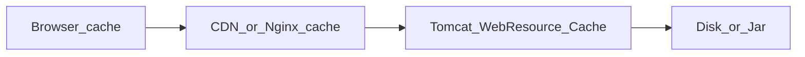

# 第9章 缓存 / 静态资源 / sendfile 调优（正文初稿）

> 对应总纲：**驯兽师修炼 · 缓存与静态交付**。读完本章，你应能区分 **浏览器缓存 / Tomcat 资源缓存 / 反向代理缓存**，会配置 **HTTP 缓存头** 与 **Connector 的 sendfile**，并会用 **命中率实验记录** 做前后对比。  
> **版本提示**：`Context` / `DefaultServlet` / `Resources` 的 **属性名与默认值** 随 Tomcat 主版本略有差异，**以你版本的 Configuration Reference 为准**。

---

## 本章导读

- **你要带走的三件事**
  1. **静态资源**：优先 **「离用户更近」**（CDN / 边缘缓存）+ **正确的 Cache-Control**；Tomcat 侧避免 **大文件打满工作线程**。
  2. **Tomcat 内存缓存**：`WebResourceRoot` 上的 **`Cache`** 减轻 **磁盘读与 Jar 内资源查找**；需限制 **`cacheMaxSize`**，防止 **堆内缓存挤占业务**。
  3. **sendfile**：在合适 OS/协议路径下 **减少用户态拷贝**；需 **实测** 是否优于普通流式写出。

- **阅读建议**：先对 **`/static/*.js`** 做一次 **Chrome DevTools → Network** 看 **from disk cache / 304**，再改一版 **ExpiresFilter**，用 **8.6 的压测纪律** 对比 TPS 与带宽。

---

## 9.1 与第6章的衔接：本主题的四段式

| 段落 | 缓存 / 静态 / sendfile |
|------|-------------------------|
| **指标** | 静态请求 RT、带宽、CPU、`304` 比例、**Tomcat Cache 命中率**（若可观测）、磁盘 read |
| **观察** | DevTools、Access log 状态码、`If-None-Match`、APM、OS `iostat`、堆占用 |
| **参数** | `ExpiresFilter`、`web.xml` DefaultServlet、`Context` Resources 缓存、`Connector` sendfile、前置 Nginx |
| **风险** | 缓存头过长导致 **发版后用户仍用旧 JS**；`cacheMaxSize` 过大 **堆压力**；sendfile 与 **压缩**、**SSL 在 Tomcat** 的组合需验证 |

---

## 9.2 三层缓存视角（必背）



| 层级 | 管什么 | Tomcat 直接关系 |
|------|--------|------------------|
| **浏览器** | `Cache-Control` / `Expires` / `ETag` / `Last-Modified` | 通过 **响应头** 影响 |
| **反向代理 / CDN** | 边缘命中、回源策略 | Tomcat 常作为 **源站** |
| **Tomcat 内部** | `webresources.Cache` 等 | **本节核心** |

---

## 9.3 浏览器与 HTTP：静态资源缓存头

### 9.3.1 常用响应头（直觉）

| 头 | 作用 |
|----|------|
| **`Cache-Control`** | `max-age`、`no-cache`、`no-store`、`immutable`（配合指纹文件名） |
| **`ETag` / `Last-Modified`** | **条件请求**：`304 Not Modified`，省 body 带宽 |
| **`Expires`** | 绝对过期时间（HTTP/1.0 时代；现代常与 `Cache-Control` 并用） |

### 9.3.2 Tomcat：`ExpiresFilter`（按类型/路径设缓存）

在 `web.xml` 中配置（示例，路径与类型按项目改）：

```xml
<filter>
  <filter-name>ExpiresFilter</filter-name>
  <filter-class>org.apache.catalina.filters.ExpiresFilter</filter-class>
  <init-param>
    <param-name>ExpiresByType application/javascript</param-name>
    <param-value>access plus 7 days</param-value>
  </init-param>
  <init-param>
    <param-name>ExpiresByType text/css</param-name>
    <param-value>access plus 7 days</param-value>
  </init-param>
  <init-param>
    <param-name>ExpiresByType image/png</param-name>
    <param-value>access plus 30 days</param-value>
  </init-param>
</filter>
<filter-mapping>
  <filter-name>ExpiresFilter</filter-name>
  <url-pattern>/static/*</url-pattern>
</filter-mapping>
```

**工程建议**：

- **带 hash 的文件名**（`app.abc123.js`）+ 长 `max-age`；**HTML** 往往 **`no-cache` 或短 max-age**，避免 **「JS 新了 HTML 还指向旧」** 的错位。
- **API JSON** 慎用强缓存；需缓存用 **显式策略** 或 **网关**。

### 9.3.3 动态页面（JSP/Servlet）的「伪静态」

- 个性化强、依赖 Cookie 的页面 **不适合** 长缓存。
- 若必须片段缓存，优先考虑 **应用侧 Redis**、**ESI**、**CDN 规则**，而不是把 Tomcat 当通用 CDN。

---

## 9.4 Tomcat 内部：`WebResourceRoot` 与 `Cache`

### 9.4.1 职责（读源码前的地图）

- 应用静态资源来自 **`WEB-INF` 外** 的 `webapps/...`、**Jar 内 META-INF/resources** 等，由 **`WebResourceRoot`** 统一抽象。
- **`org.apache.catalina.webresources.Cache`**（及其实现）缓存 **解析后的资源元数据与内容**（具体缓存粒度以源码为准），减少 **重复打开文件 / JarEntry**。

### 9.4.2 配置入口：`Context` → `Resources`

在 **`META-INF/context.xml`** 或 **`conf/context.xml`**（全局）中常见写法（**属性名请查文档**）：

```xml
<Context>
  <Resources cachingAllowed="true"
             cacheMaxSize="51200"
             cacheObjectMaxSize="512"
             cacheTTL="5000" />
</Context>
```

**直觉解释（教学向）**：

- **`cachingAllowed`**：是否启用该层缓存。
- **`cacheMaxSize`**：缓存 **总上限**（单位常见为 **KB**，以文档为准）。
- **`cacheObjectMaxSize`**：单个资源 **超过则不进缓存**（避免大文件占满）。
- **`cacheTTL`**：条目 **存活时间**（毫秒，以文档为准）。

**风险**：`cacheMaxSize` **过大** → 堆内压力上升，与 **第7章** 抢内存；**过小** → 频繁读盘，CPU 与 IO 上升。

### 9.4.3 源码锚点：`org.apache.catalina.webresources.Cache`

**读什么**：

1. **何时 `get`**：是否先查内存再落盘。
2. **淘汰策略**：LRU 或近似实现（类注释/字段名）。
3. **与 `StandardRoot` 的关系**：谁在创建 `Cache`、谁在 `destroy` 时清空。

**读法提示**：对照 **`DefaultServlet`**（`serveResource` 路径）看 **资源读取热点**，再回到 `Cache` 类。

---

## 9.5 sendfile：零拷贝直觉与配置

### 9.5.1 原理（白话）

传统路径：`磁盘 → 内核读缓冲 → JVM 缓冲 → 内核 socket 缓冲 → 网卡`。  
**sendfile**：在支持的路径上，让 **OS 在内核侧** 把文件数据 **直接送到 socket**，**减少用户态拷贝**。

### 9.5.2 Tomcat：`Connector` 与 `DefaultServlet`

`server.xml` 中常见属性（名称以文档为准）：

```xml
<Connector port="8080"
           protocol="HTTP/1.1"
           useSendfile="true"
           sendfileSize="48" />
```

- **`useSendfile`**：是否启用 sendfile（部分场景下自动不满足条件会回退普通写出）。
- **`sendfileSize`**：常见含义为 **启用 sendfile 的最小文件大小（KB）**；过小文件可能 **不值得** 走 sendfile。

### 9.5.3 适用与不适用

| 更适合 | 更需谨慎 |
|--------|----------|
| **大静态文件**、下载 | **TLS 终结在 Tomcat** 时路径复杂，需 **实测** |
| 配合 **NIO/APR** 等实现 | 与 **响应压缩（gzip）** 同时开启时，可能 **互斥或退化为非 sendfile** |
| 源站直出静态 | 小文件、动态生成流 **收益有限** |

---

## 9.6 与第8章、前置 Nginx 的配合

- **Nginx `open_file_cache`**、**`sendfile on`**、**`tcp_nopush`**：常与 Tomcat **分工**——静态尽量 **Nginx 直出**，Tomcat 专注 **动态**。
- 若 **全站经 Tomcat**：更要管好 **`cacheMaxSize`** 与 **JVM 堆**，避免 **静态洪峰拖垮堆**。

---

## 9.7 关键产出：命中率 / 带宽优化实验记录模板

复制后填写（呼应第6章 **单一变量**）：

```markdown
## 实验：静态与缓存优化
- 日期 / Tomcat 版本 / JDK：
- 资源类型：如 /static/*.js，总大小 ___ MB

### 基线（优化前）
- Cache-Control / ETag 现状：（贴响应头或写无）
- Tomcat Resources：cachingAllowed= cacheMaxSize=
- Connector：useSendfile= sendfileSize=
- 压测：并发 ___ 持续 ___ s，静态 URL TPS= P95= 带宽=
- 304 比例（若有）：___ %

### 变更（仅列 1 个主变量）
- 变更项：如 ExpiresFilter / cacheMaxSize / Nginx 直出静态

### 回归（优化后）
- 同上指标：
- 堆使用 / GC 是否变化：（第7章联动）

### 结论
- 有效 / 无效 / 需回滚：
- 副作用：（发版缓存、命中错误资源等）
```

**命中率补充**：

- **浏览器侧**：DevTools **Size 列** `from disk cache` / `(memory cache)`。
- **304 比例**：Access log 统计 **`304 / 静态路径`**。
- **Tomcat 内部 Cache**：若未暴露 MBean，可用 **调试日志** 或 **源码临时埋点**（进阶）。

---

## 本章小结

- **静态资源**：**HTTP 头** 决定浏览器行为；**Tomcat Cache** 减轻本机读盘；**CDN** 减轻源站。
- **`webresources.Cache`** 是 **JVM 堆内** 的缓存，**必须设上限** 并观察 GC。
- **sendfile** 是 **交付路径优化**，需 **与压缩、TLS、文件大小** 一起实测。

---

## 自测练习题

1. **`ETag` + `If-None-Match`** 返回 `304` 时，主要省了哪部分成本？
2. 为什么 **HTML 长缓存 + JS 不带指纹** 容易导致线上 **「改了不生效」**？
3. **`cacheObjectMaxSize`** 过小会导致什么现象？

---

## 课后作业

### 必做

1. 选一个静态目录，**优化前/后** 各抓 **一张** Response Headers 截图（含 `Cache-Control` 或 `Expires`）。
2. 填写 **9.7 模板** 一轮（可小规模 `ab`/`wrk` 只打静态 URL）。
3. 在源码中打开 **`org.apache.catalina.webresources.Cache`**，写 **5 行**：该类缓存的 **key** 大致是什么（路径？Jar？）。

### 选做

1. 对比 **`useSendfile=true/false`** 下 **大文件下载** 的 CPU%（同文件、同并发）。
2. 画 **一张** 架构图：**静态走 Nginx、动态走 Tomcat** 时，缓存各落在哪一层。
3. 预习第10章：思考 **Access log 打满磁盘** 如何被误判为 **「缓存失效」**。

---

## 延伸阅读

- Tomcat 官方：**DefaultServlet**、**Context**、**Resources**、**Filters**（ExpiresFilter）。
- 第8章：[`第8章-Connector与线程模型调优.md`](第8章-Connector与线程模型调优.md)（sendfile 与 Connector）。

---

*本稿为专栏第9章初稿，可与总纲 [`专栏.md`](专栏.md) 对照使用。*
